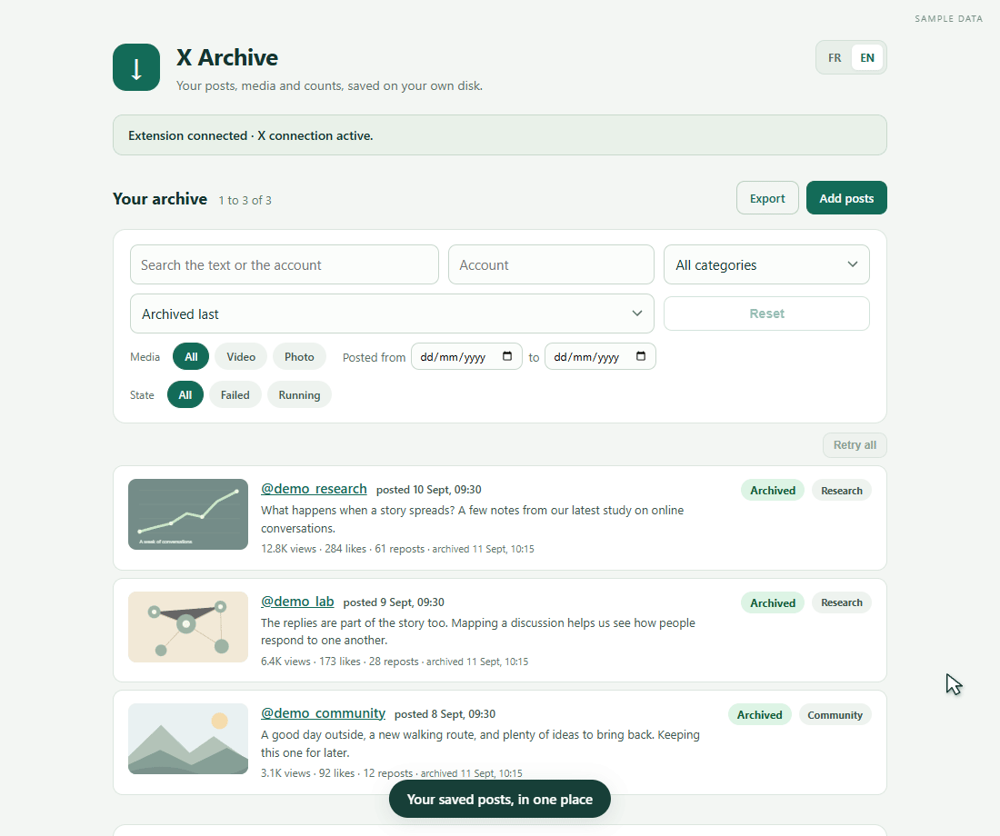

# Twitter / X Tweet Archiver

*The demo uses sample posts.*

I made this to save tweets from X / Twitter without having to organize every file by hand. An archive can include the post data, media, available replies and their links to one another. Your archive is stored on your computer.

You can add a post from the small button shown on X, choose a category, and find it in the local app a moment later. When you need the data, export it as CSV with the media and the original data files.

## Download

The easiest version is currently for **Windows with Chrome, Edge or Brave**.

[**Download for Windows**](https://github.com/oliviercaron/twitter-x-archiver/releases/latest/download/twitter-x-archiver-windows.zip) · [All downloads](https://github.com/oliviercaron/twitter-x-archiver/releases/latest)

1. Download the Windows ZIP from the release page and extract the whole folder.
2. Run `INSTALL.cmd` once, then load the `chrome-extension` folder from your browser's extensions page with Developer mode enabled.
3. Run `START.cmd`, sign in to X in the same browser, and start archiving.

The app chooses a local archive folder automatically. You can open or change it later from **Archive storage**. Changing it copies and checks the archive before switching, and keeps the old copy.

More help: [installation guide](docs/INSTALL.md).

## What it saves

- Post text, author, dates, counts and the other fields returned by X
- Images and videos when they are available
- Available replies, including nested reply chains
- Your category and note for each post
- CSV exports: one table for posts and one for count readings, with media and full source data beside them

X does not always return every reply or every field, so the tool does not claim that a discussion is complete. When X limits the request rate, the app pauses and continues later. You can see that state in the archive page.

## Other browsers and systems

Firefox is included as an unsigned test add-on. It has to be loaded temporarily and disappears when Firefox restarts. A permanent Firefox release still needs Mozilla signing.

The source package can run on macOS with Python. Chrome can use the included extension there. Safari support is provided as source to build with Xcode, but it has not yet been tested on a real Mac or released as a signed Safari app.

See the [installation guide](docs/INSTALL.md) for the current setup options.

## Privacy

Archives, categories, settings and exports are stored locally. There is no analytics or third-party storage service in the extension. The local service contacts X only to retrieve the posts you ask it to archive.

This project is independent and is not affiliated with X.

[Privacy details](docs/PRIVACY.md) · [MIT license](LICENSE) · [Development notes](docs/DEVELOPMENT.md)
